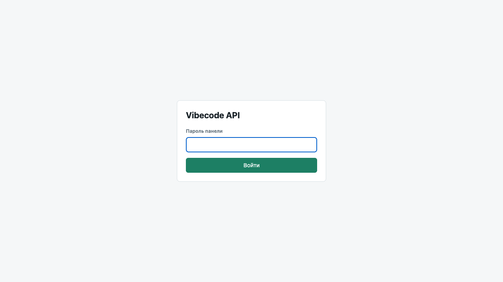
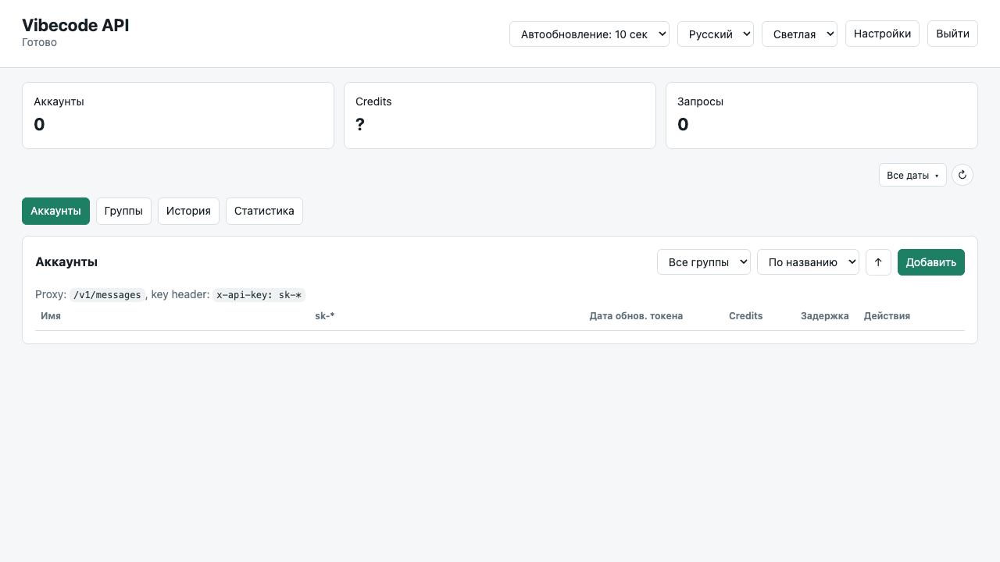

# kiro2cc

`kiro2cc` - Docker-friendly Anthropic-compatible proxy для Kiro/CodeWhisperer.

Актуальный способ авторизации: взять auth JSON Kiro CLI из SQLite, добавить его в админке и использовать локальный proxy key формата `sk-*` в клиентах. В этом JSON есть `refresh_token`, поэтому `kiro2cc` сохраняет его в аккаунте и сам продлевает KAS token без запуска `kiro-cli`.

## Возможности

- `POST /v1/messages` в формате Anthropic Messages API;
- `POST /v1/chat/completions` в формате OpenAI Chat Completions для OpenAI-compatible клиентов и New API OpenAI provider;
- Docker Compose запуск;
- web admin UI на `/admin`;
- несколько аккаунтов Kiro/KAS;
- локальные ключи `sk-*` для выбора аккаунта;
- healthcheck аккаунта реальным минимальным CodeWhisperer-запросом;
- dashboard с аккаунтами, credits, статусами и историей запросов;
- ручное и автоматическое обновление KAS token через сохраненный `refresh_token`;
- русский, английский и китайский язык UI.

## Скриншоты





## Docker

```bash
docker compose up --build
```

Админка:

```text
http://localhost:8080/admin
```

Proxy endpoint:

```text
http://localhost:8080/v1/messages
http://localhost:8080/v1/chat/completions
```

Compose хранит аккаунты в Docker volume `kiro2cc-tokens`. Кнопка `Обновить токен` и автообновление используют только `refresh_token`, сохраненный в token-файле аккаунта. SQLite Kiro CLI и `kiro-cli` внутри контейнера не используются.

## Быстрый старт macOS

Выполни логин в Kiro CLI:

```bash
"/Applications/Kiro CLI.app/Contents/MacOS/kiro-cli" login --license free --use-device-flow
```

Получи JSON с `refresh_token`:

```bash
sqlite3 "$HOME/Library/Application Support/kiro-cli/data.sqlite3" "select value from auth_kv where key='kirocli:social:token';" | jq .
```

Запусти proxy:

```bash
docker compose up -d --build
```

Открой `http://localhost:8080/admin`, нажми `Добавить`, вставь JSON из SQLite в поле `KAS JSON из CLI`, оставь `Proxy key sk-*` пустым или задай свой ключ.

## Как получить валидный KAS token

### macOS

```bash
"/Applications/Kiro CLI.app/Contents/MacOS/kiro-cli" login --license free --use-device-flow
sqlite3 "$HOME/Library/Application Support/kiro-cli/data.sqlite3" "select value from auth_kv where key='kirocli:social:token';" | jq .
```

Команда выводит JSON с `refresh_token`:

```json
{
  "access_token": "...",
  "refresh_token": "...",
  "expires_at": "2026-06-10T22:51:18.575431342Z",
  "profile_arn": "arn:aws:codewhisperer:us-east-1:699475941385:profile/...",
  "provider": "google"
}
```

Именно этот формат нужен для админки: `access_token` используется сразу, а `refresh_token` сохраняется и используется для автоматического продления KAS token.

В админке добавь аккаунт:

- `name` - любое имя, например `work`;
- `KAS JSON из CLI` - вставь весь JSON из SQLite, обязательно с `refresh_token`;
- `Proxy key sk-*` можно оставить пустым, ключ сгенерируется автоматически.

В token-файл аккаунта сохраняются `accessToken`, `refreshToken`, `expiresAt`, `profileArn`, `apiKey`, credits и последняя задержка теста.

## Обновление KAS token

Есть два механизма:

- кнопка `Обновить токен` в строке аккаунта;
- внутренний scheduler: раз в минуту перечитывает текущие аккаунты и обновляет те, чей `expiresAt` уже истек или истечет меньше чем через 5 минут.

Это не системный cron и не отдельные задачи на каждый аккаунт. Если аккаунт удалить из админки, scheduler просто перестанет видеть его token-файл, поэтому “осиротевшая” задача не остается.

## Использование в клиентах

В админке у аккаунта будет локальный ключ формата `sk-*`. Используй его как `ANTHROPIC_API_KEY`:

```bash
export ANTHROPIC_BASE_URL=http://localhost:8080
export ANTHROPIC_API_KEY=sk-...
```

Запрос:

```bash
curl -X POST http://localhost:8080/v1/messages \
  -H "Content-Type: application/json" \
  -H "x-api-key: sk-..." \
  -d '{
    "model": "claude-3-5-haiku-20241022",
    "max_tokens": 128,
    "messages": [
      {"role": "user", "content": "Привет"}
    ],
    "stream": false
  }'
```

Proxy всегда выбирает аккаунт по `sk-*` ключу. Передавай его в `x-api-key` или `Authorization: Bearer`.

OpenAI-compatible запрос для New API или обычных Chat Completions клиентов:

```bash
curl -X POST http://localhost:8080/v1/chat/completions \
  -H "Content-Type: application/json" \
  -H "Authorization: Bearer sk-..." \
  -d '{
    "model": "claude-haiku-4.5",
    "messages": [
      {"role": "user", "content": "Привет"}
    ],
    "stream": false
  }'
```

Этот endpoint конвертирует OpenAI Chat Completions в Anthropic Messages, затем в Kiro/CodeWhisperer. Для `stream: true` возвращается OpenAI-compatible SSE stream. Это позволяет в New API держать канал как `OpenAI provider`: баланс обновляется через OpenAI billing endpoints, а запросы к Claude/Kiro моделям идут через `/v1/chat/completions`.

## Credits / usage

Kiro CLI умеет показать usage:

```bash
kiro-cli chat --no-interactive "/usage"
```

На macOS:

```bash
"/Applications/Kiro CLI.app/Contents/MacOS/kiro-cli" chat --no-interactive "/usage"
```

Пример:

```text
Estimated Usage | resets on 2026-07-01 | KIRO FREE
Credits (0.11 of 50 covered in plan)
```

В Docker macOS-бинарь `kiro-cli` выполнить нельзя, поэтому dashboard показывает:

- credits из Kiro CLI, если `kiro-cli` доступен в окружении сервера;
- иначе сохраненное вручную значение `Credits осталось`;
- иначе `?`.

Для Docker-сценария обновляйте остаток так:

```bash
"/Applications/Kiro CLI.app/Contents/MacOS/kiro-cli" chat --no-interactive "/usage"
```

В выводе будет строка вида:

```text
Credits (0.15 of 50 covered in plan)
```

Остаток: `50 - 0.15 = 49.85`. Это значение можно вписать в поле `Credits осталось` при сохранении аккаунта.

## Admin API

- `GET /admin` - web UI;
- `GET /admin/api/accounts` - список аккаунтов;
- `POST /admin/api/accounts` - создать или обновить аккаунт;
- `POST /admin/api/accounts/{name}/check` - проверить KAS token реальным запросом;
- `POST /admin/api/accounts/{name}/token` - обновить KAS token через `refresh_token`;
- `DELETE /admin/api/accounts/{name}` - удалить аккаунт;
- `GET /admin/api/history` - последние 1000 запросов, сохраняются в Docker volume;
- `GET /admin/api/usage` - credits/usage через Kiro CLI, если доступен;
- `GET /health` - healthcheck сервера.

Пример создания аккаунта:

```json
{
  "name": "work",
  "accessToken": "...",
  "profileArn": "arn:aws:codewhisperer:us-east-1:699475941385:profile/...",
  "expiresAt": "2026-06-10T18:10:07.185487Z"
}
```

Если создаешь через UI, можно вставлять исходный SQLite JSON:

```json
{
  "access_token": "...",
  "refresh_token": "...",
  "expires_at": "2026-06-10T22:51:18.575431342Z",
  "profile_arn": "arn:aws:codewhisperer:us-east-1:699475941385:profile/...",
  "provider": "google"
}
```

Ответ содержит `apiKeyPreview`, полный `apiKey` хранится в token-файле внутри Docker volume.

## Локальная разработка

```bash
go test ./...
go build -o kiro2cc main.go
./kiro2cc server 8080
```

По умолчанию локальные аккаунты хранятся в:

```text
~/.kiro2cc/tokens
```

Можно переопределить:

```bash
export KIRO2CC_TOKEN_DIR=/path/to/tokens
```

## Модели

Поддерживаемые входные имена моделей задаются в `ModelMap`.
`/v1/models` с `x-api-key` сначала запрашивает список доступных моделей у Kiro для конкретного аккаунта, а при ошибке возвращает локальный fallback:

- `auto`;
- `claude-sonnet-4.5`;
- `claude-sonnet-4`;
- `claude-haiku-4.5`;
- `deepseek-3.2`;
- `minimax-m2.5`;
- `minimax-m2.1`;
- `glm-5`;
- `qwen3-coder-next`.
